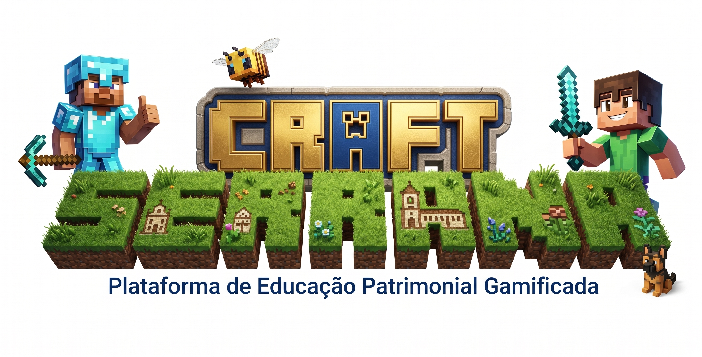

# 🎮 SERRANACRAFT

### Plataforma de Educação Patrimonial Gamificada de Nova Serrana

  

**Tecnologia • Educação • Cultura • Memória Histórica • Inovação**

---

## 📑 Sumário

* [📖 Sobre o Projeto](#-sobre-o-projeto)
* [🎯 Objetivos](#-objetivos)
* [🏛️ Contexto Histórico](#️-contexto-histórico)
* [🚀 Componentes da Plataforma](#-componentes-da-plataforma)
* [🛠️ Tecnologias](#️-tecnologias)
* [📈 Roadmap](#-roadmap)
* [🤝 Parceiros](#-parceiros)
* [👨‍🏫 Coordenação](#-coordenação)

---

# 📖 Sobre o Projeto

O **SERRANACRAFT** é uma iniciativa de educação patrimonial gamificada que busca aproximar estudantes e comunidade da história de Nova Serrana utilizando tecnologias digitais, ambientes interativos e metodologias inovadoras de aprendizagem.

A proposta nasce de uma pergunta simples:

> **Como ensinar a história de Nova Serrana utilizando as linguagens que as novas gerações já utilizam diariamente?**

O projeto pretende transformar o patrimônio cultural em uma experiência viva, colaborativa e acessível, conectando memória histórica, inovação tecnológica e educação.

---

# 🎯 Objetivos

✅ Preservar e difundir a memória histórica local

✅ Fortalecer a identidade cultural das novas gerações

✅ Utilizar tecnologias digitais como ferramentas educacionais

✅ Incentivar a participação comunitária

✅ Promover inovação aplicada à educação patrimonial

✅ Integrar cultura, tecnologia e pesquisa

---

# 🏛️ Contexto Histórico

O projeto contempla estudos e reconstruções digitais relacionados a:

| Tema                           | Descrição                                   |
| ------------------------------ | ------------------------------------------- |
| 🐎 Tropeirismo                 | Rotas comerciais e desenvolvimento regional |
| 🐂 Pecuária                    | Formação econômica inicial                  |
| 🏘️ Cercado                    | Antigo núcleo populacional                  |
| 👞 Indústria Calçadista        | Transformação econômica de Nova Serrana     |
| 📜 Patrimônio Cultural         | Memória material e imaterial                |
| 👨‍👩‍👧‍👦 Famílias Pioneiras | Formação social do município                |

---

# 🚀 Componentes da Plataforma

## 🎮 Plataforma Gamificada

Experiências digitais voltadas ao aprendizado histórico.

## 🌐 Servidor Cultural SerranaCraft

Espaço virtual para atividades colaborativas.

## 📚 Material Pedagógico

Conteúdo de apoio para escolas e pesquisadores.

## 🏫 Oficinas Educacionais

Atividades voltadas para estudantes e educadores.

## 🏆 Sistema de Engajamento

Missões, desafios e participação cultural.

## ♿ Inclusão e Acessibilidade

Recursos para ampliar o acesso ao conhecimento.

---

# 🛠️ Tecnologias

| Infraestrutura | Desenvolvimento | Dados           | IA                        |
| -------------- | --------------- | --------------- | ------------------------- |
| Magalu Cloud   | Node.js         | PostgreSQL      | APIs de IA                |
| Linux          | Python          | SQL             | Assistentes Educacionais  |
| Docker         | JavaScript      | Banco Histórico | Processamento de Conteúdo |

---

# 📸 Galeria

## Banner Institucional

---

# 📈 Roadmap

### Fase 1 — Planejamento

* [x] Conceito definido
* [x] Estruturação institucional
* [x] Documentação inicial
* [x] Repositório GitHub

### Fase 2 — Pesquisa Histórica

* [ ] Levantamento documental
* [ ] Mapeamento patrimonial
* [ ] Organização do acervo digital

### Fase 3 — Desenvolvimento

* [ ] Infraestrutura em nuvem
* [ ] Banco de dados
* [ ] Plataforma web
* [ ] Ambiente gamificado

### Fase 4 — Educação e Comunidade

* [ ] Oficinas
* [ ] Escolas parceiras
* [ ] Testes piloto
* [ ] Eventos culturais

---

# 🤝 Parceiros Potenciais

* 🏫 Instituições de Ensino
* 🏛️ Secretaria Municipal de Cultura
* 📚 Secretaria Municipal de Educação
* 💻 Empresas de Tecnologia
* 🌎 Comunidade Open Source
* ☁️ Magalu Cloud

---

# 🌎 Localização

📍 Nova Serrana — Minas Gerais — Brasil

---

# 👨‍🏫 Coordenação

**Jhonessena**

Professor Universitário • Advogado • Pesquisador • Entusiasta de Tecnologia e Inovação

---

# 💡 Visão

> "Preservar o passado utilizando as tecnologias do futuro."

O SERRANACRAFT busca demonstrar que patrimônio cultural, educação e inovação podem caminhar juntos, criando novas formas de aprendizado e fortalecendo a identidade das futuras gerações.

---

# 📄 Licença

Projeto em desenvolvimento para fins educacionais, culturais, científicos e de inovação social.
